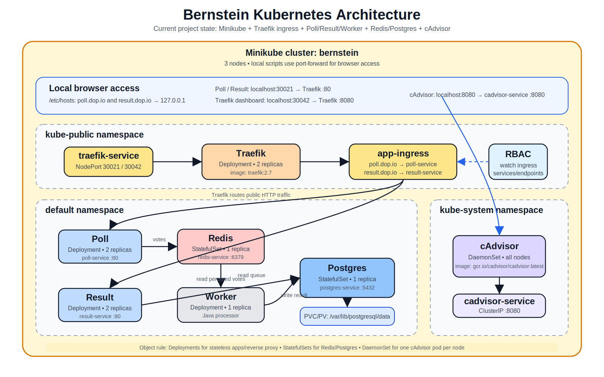

# Bernstein

Bernstein is a Kubernetes project running a small voting application on a local Minikube cluster.

The stack is composed of:

- `poll`: Flask frontend used to vote.
- `redis`: queue/cache used by Poll.
- `worker`: Java service moving votes from Redis to Postgres.
- `postgres`: persistent database storing votes.
- `result`: Node.js frontend used to display results.
- `traefik`: ingress controller and reverse proxy.
- `cadvisor`: node/container monitoring agent.

## Architecture



## Project Structure

```text
db/
  redis/         Redis StatefulSet, Service, ConfigMap
  postgres/      Postgres StatefulSet, Service, ConfigMap, PV/PVC, schema

services/
  poll/          Poll Deployment and Service
  worker/        Worker Deployment
  result/        Result Deployment and Service

utils/
  ingress.yaml   Shared Ingress for poll.dop.io and result.dop.io
  traefik/       Traefik Deployment, Service, RBAC
  cadvisor/      cAdvisor DaemonSet and Service

scripts/
  start-*.sh     Step-by-step startup scripts
  expose-*.sh    Local browser exposure script
  reset-*.sh     Cleanup script
```

## Requirements

Install before starting:

- Docker Desktop
- Minikube

This project uses Minikube with the Docker driver and 3 nodes.

## Start After Pulling

From the project root:

```bash
chmod +x scripts/*.sh
./scripts/start-project.sh
```

During startup, `scripts/start-postgres.sh` asks for the Postgres username and password. These values are stored in a Kubernetes Secret, not committed in the repository.

The last script, `scripts/expose-services.sh`, keeps port-forwarding alive. Keep that terminal open.

## Exposed URLs

After startup:

```text
Poll:              http://poll.dop.io:30021
Result:            http://result.dop.io:30021
Traefik dashboard: http://localhost:30042
cAdvisor:          http://localhost:8080
```

`scripts/expose-services.sh` automatically adds this line to `/etc/hosts` if missing:

```text
127.0.0.1 poll.dop.io result.dop.io
```

## Useful Commands

Check cluster status:

```bash
./scripts/status-minikube.sh
```

Expose services again without recreating the cluster:

```bash
./scripts/expose-services.sh
```

Reset the local cluster and project images:

```bash
./scripts/reset-minikube.sh
```

## Kubernetes Object Types

- `Deployment`: stateless app replicas (`poll`, `result`, `worker`, `traefik`).
- `StatefulSet`: stateful services with stable identity (`redis`, `postgres`).
- `DaemonSet`: one monitoring pod per node (`cadvisor`).
- `Ingress`: routes `poll.dop.io` and `result.dop.io` through Traefik.
